欢迎来到这里，感谢大家支持，如果你有一台3D打印机，现在你可以为自己打印更漂亮⭐更具个人特色😎的外壳!并且如果你有足够的时间，可以选择更精细的打印精度。

我在打印时使用了PLA和PETG材料，在这两种材料下，如果打印机设置正确的话，打印效果还算不错。

本目录包含各个版本的外壳模型，并且根据版本进行排序（数字排序，越大越新）。

注意，较老版本的模型将不再更新或者修改。

> [!WARNING]
> 警告，拆卸壳体有可能损坏设备，你需要自己承担后果。

> [!IMPORTANT]
> 声明：如果你喜欢FlipperZero项目，并且拥有足够的经济能力，可以通过官方渠道购买原版设备，构建如此强大的社区并不容易，感谢他们开源了大量资料。我的设备并不是为了伪造或者盗版，而是针对性进行了一些修改，且使用了全新的外观用于区分，与原版设备的外壳完全不兼容。目的是制作更廉价的设备，使项目得到更好的发展。

> [!IMPORTANT]
> 再次声明：设备仅用作专业人员的合法技术学习和合法分析测试（你最好知道你自己在干什么）。

### 开始打印自己的外壳前，你需要知道：
1、由于成本的压缩，以及项目开始时间不长，结构上并不是那么完美，拆装有风险，请仔细阅读说明，并且确保你有一个电烙铁和灵活的双手。
2、更换和安装外壳需要一定的动手能力，开始之前确定你可以搞定，不要弄坏你的设备，因为拆卸导致的后果，由你自己承担。
3、确保3D打印机的打印板干净，富有粘性，因为打印正面的"R"和"O"的时候，对打印板有较高的要求（我最初打印的时候因为打印板不够干净，粘性较差，失败了很多次）。
4、请正确选择自己的外壳版本，需要注意每个底壳并不兼容，建议使用单个目录下的所有文件，不要混用。
5、做好心理准备，内部由于是手工组装焊接的，所以会有焊接的痕迹~（还要什么自行车:roll_eyes:~）

### 如何分辨版本？观察底壳的花纹图案!

**1、如果看起来是这样的则表示是大型RFID线圈，请选择[1_Big_Coil](./1_Big_Coil)***不再维护*
*这个目录包括4个零件：顶部壳体、底部壳体、按键、导光柱。*
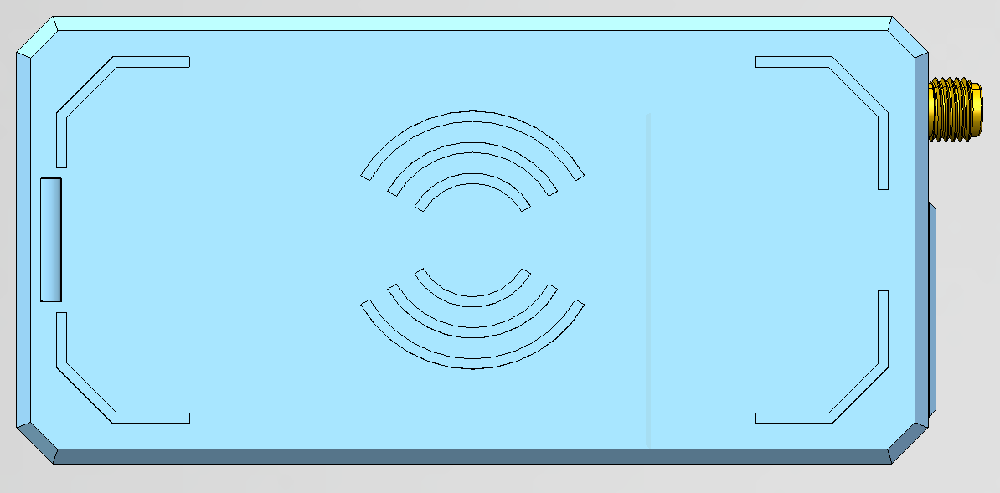

> [!TIP]
> LED_Light_Pipe.step是设备正面的导光柱，需要使用透明耗材进行打印，如果没有可以空置，或者填充一些半透明的胶水。或者可以从现有的壳体上拆下来继续使用（详见文末）。

> [!TIP]
> 另外还需要一个红外透光片，理论上最好使用专用的红外滤波片（940nm），或者一些更容易获取的透明塑料薄片，尺寸是18.5mm*8mm，厚度约0.2~0.3mm。也可以从现有的壳体上拆下来继续使用（详见文末）。

**2、大型RFDI线圈的外壳还包括透明版本，请选择[2_Big_Coil_Transparent](./2_Big_Coil_Transparent)***不再维护*
*这个目录包括3个零件：顶部壳体、底部壳体、按键。*
为了简化零件数量，透明版本对“红外透光区域”和“导光柱”进行了优化，不需要额外的零件，而是靠外壳本身透光，所以打印和装配更加简单
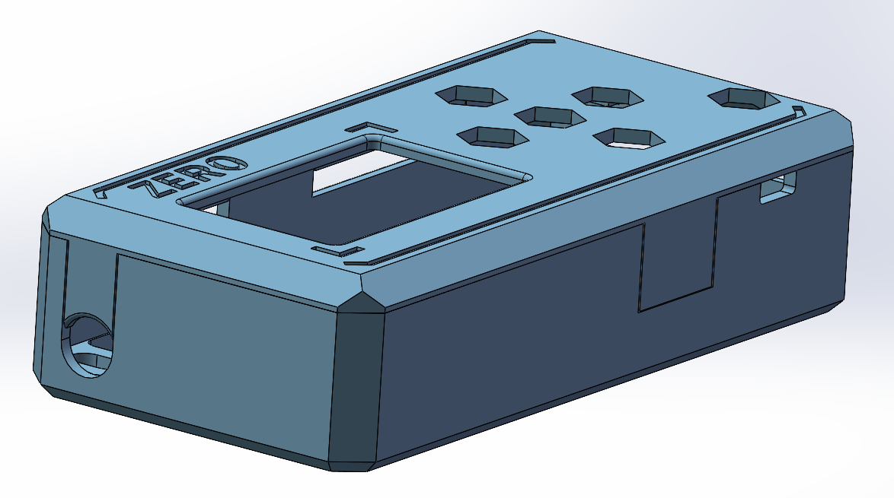
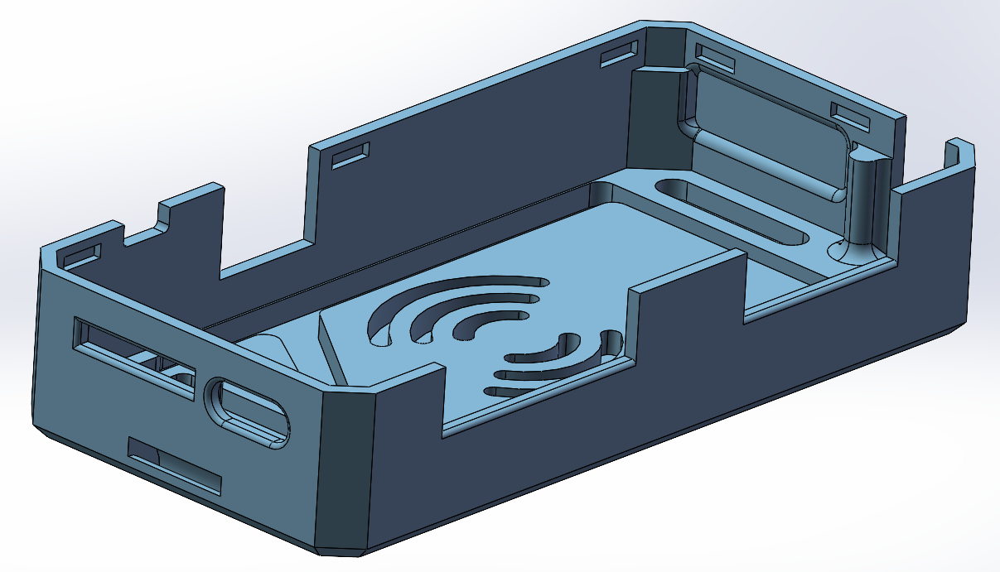

**3、如果看起来是这样的则表示是小型RFID线圈，请选择[3_Small_Coil](./3_Small_Coil)**
*这个目录包括4个零件：顶部壳体、底部壳体、按键、导光柱。*
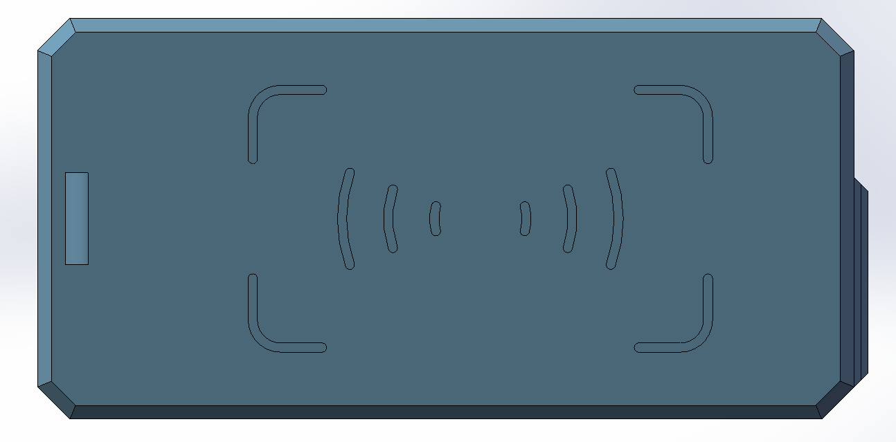
除了底壳的线圈有些改动外，其余部分基本与第一版相同。

**4、小型RFID线圈的透明版本，请选择[4_Small_Coli_Transparent](./4_Small_Coli_Transparent)**
*这个目录包括3个零件：顶部壳体、底部壳体、按键。*
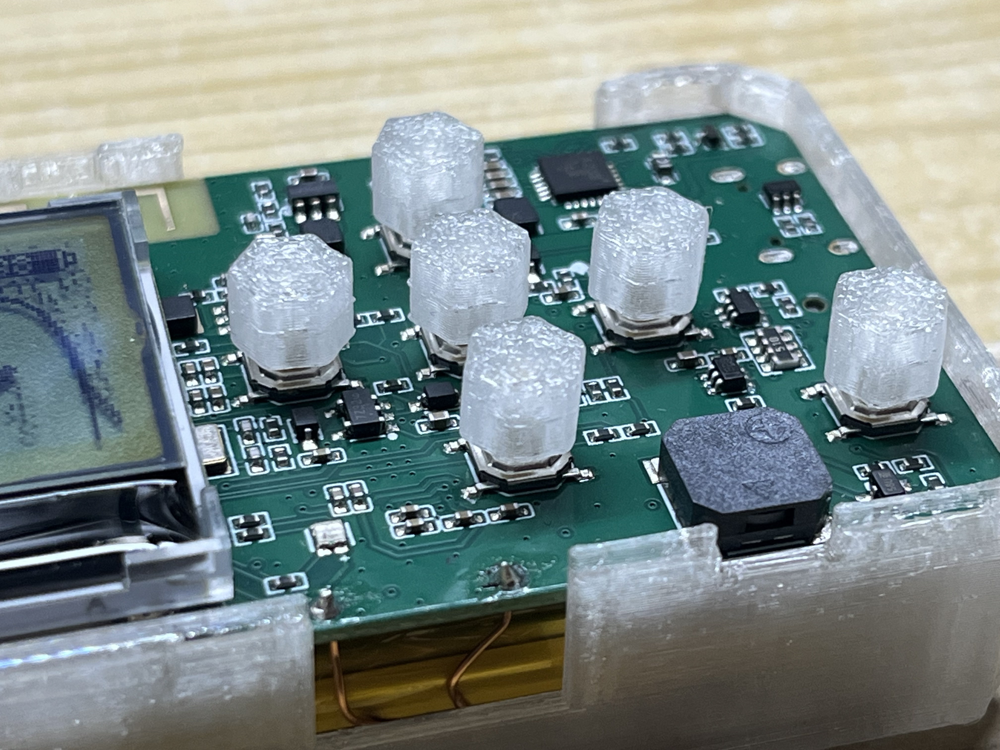
在原有基础上，减少了顶面和底面的厚度。并且改变了键帽的安装方式，现在的键帽可以直接按压安装到按键上，而不会遮挡其他位置，以此获得最好的透明效果。
不过，如果你想要追求更加通透的效果，还是建议直接使用第三个版本的模型，使用光固化打印，并进行一些后处理。

### 拆卸及组装说明：

目前来说，虽然各个版本的外壳、以及内部零件有所不同，但是拆装步骤基本相同。

> [!TIP]
> 拆卸之前，你可以触摸附近的接地金属，或者使用静电手环，避免静电损坏电路板。

**1、拆掉顶壳**
观察设备侧面，可以看到一条缝隙，使用刀片或者指甲小心翘开。
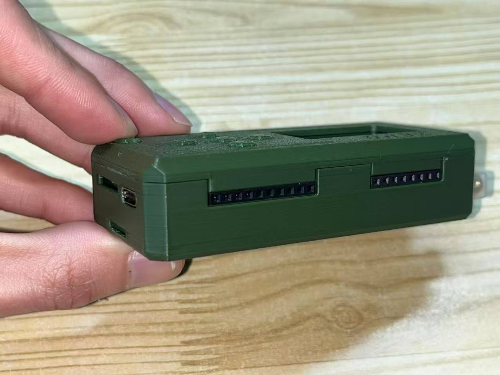
然后你会看到设备的内部电路板
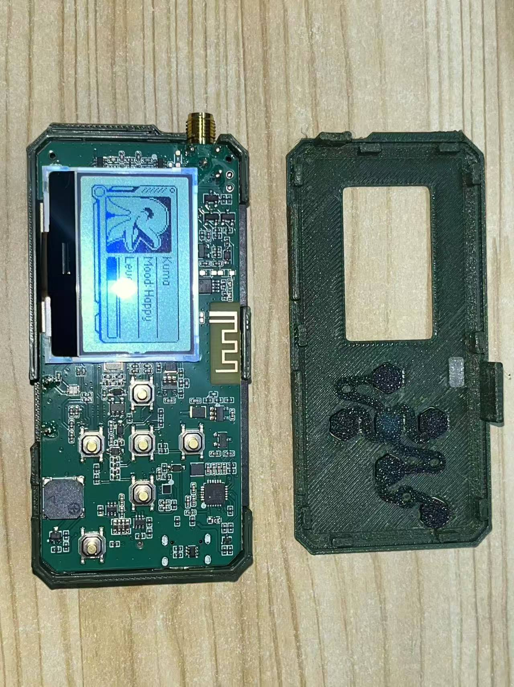

**2、断开连接线**

长按返回键，关闭设备电源。
然后使用电烙铁和镊子拆卸NFC线圈。镊子夹紧电线，向下使力，同时加热焊锡。

> [!TIP]
> 即便关机了，但是电路板很多位置依然带电，务必小心。另外尽量确保你的电烙铁接地良好。

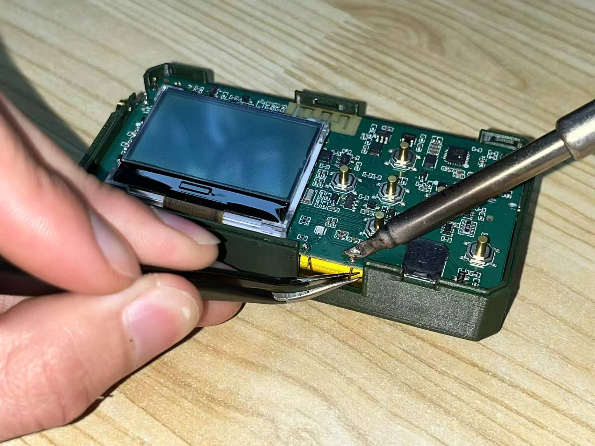

**3、拿出主板**
注意！主板背后还有两处连接线，小心取出。这是取出之后的样子：
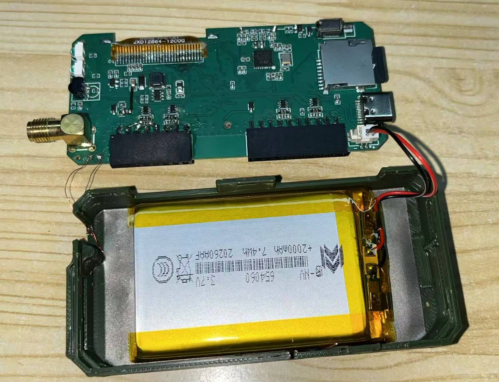
左侧是RFID线圈连接线，右侧是电池连接线。首先拔出右侧的电池连接插头，然后使用电烙铁拆除左侧的RFID连接线。

**4、拆掉电池**
> [!WARNING]
> 这一步风险较高，由于胶水粘连，可能会损坏电池，甚至导致短路等风险，后果自负！

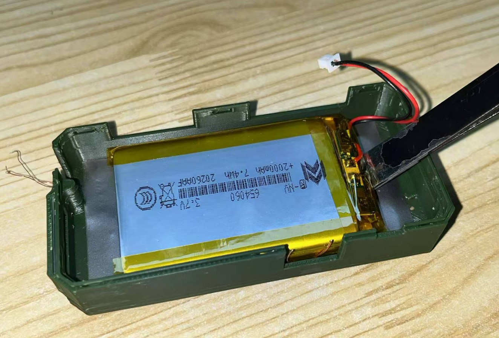
电池与底部的隔磁贴纸使用3M双面胶连接，隔磁贴纸又与壳体使用3M双面胶连接。
使用镊子尾部或者撬片，从侧面翘起电池，或者使用镊子挑起隔磁贴纸的一角，尝试直接将贴纸从壳体上剥离下来。如果非常难拆卸，可以尝试把设备短暂放到冰箱，可能会使胶水变得脆弱一些，或者使用热吹风加热壳体底部，可能会使胶水软化。

> [!WARNING]
> 如果确定壳体不再使用，也可以先暴力破坏壳体，再从侧面小心拆卸电池。

**5、取出线圈**
如果你完成了上述步骤的话，这一步就只是拿出里面的线圈。恭喜你即将拆卸完成。

现在，把这些步骤再反向重复一遍，装回到新的壳体里。

需要注意的是在我进行线圈固定时，尝试过多种固定方式，其中有些使用了“UV固化胶”，它非常结实可靠😓，但是会对拆解不太友好，恐怕你必须得破坏壳体，才能将线圈小心的翘下来。

> [!TIP]
> 拆卸过程中，小心不要刮坏线圈表明的绝缘漆，可能会导致线圈之间异常短路，影响读写效果。

### 小零件的拆卸及组装说明：

**附1、导光柱拆装**
使用镊子从正面将导光柱用力按进去。
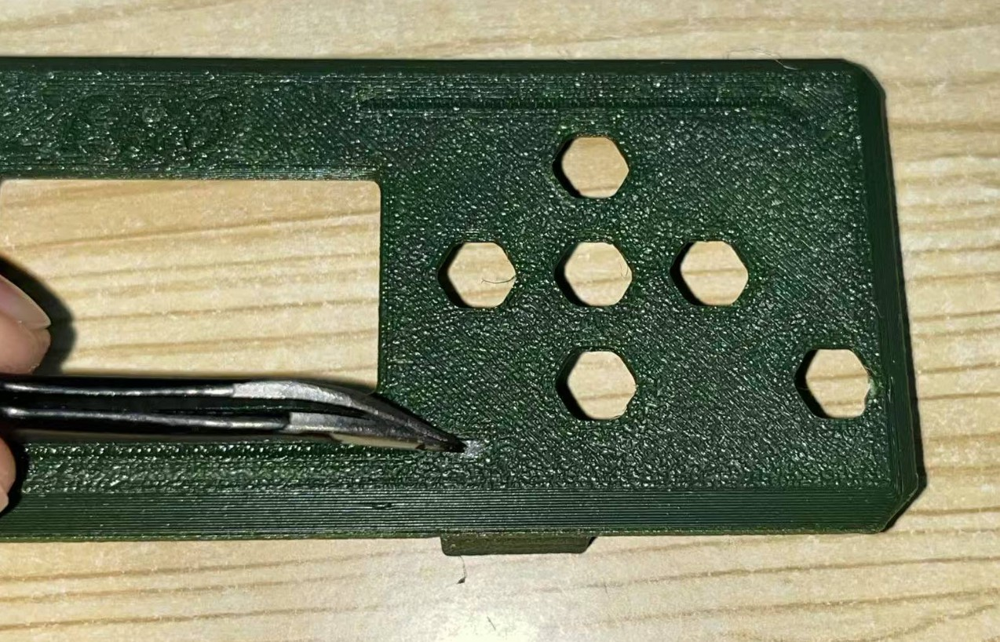

**附2、透光片拆装**
使用镊子将透光片轻松取出，从图片里可以看到，它就是这样塞进去的，然后通过上壳体将它按压在这个槽里。
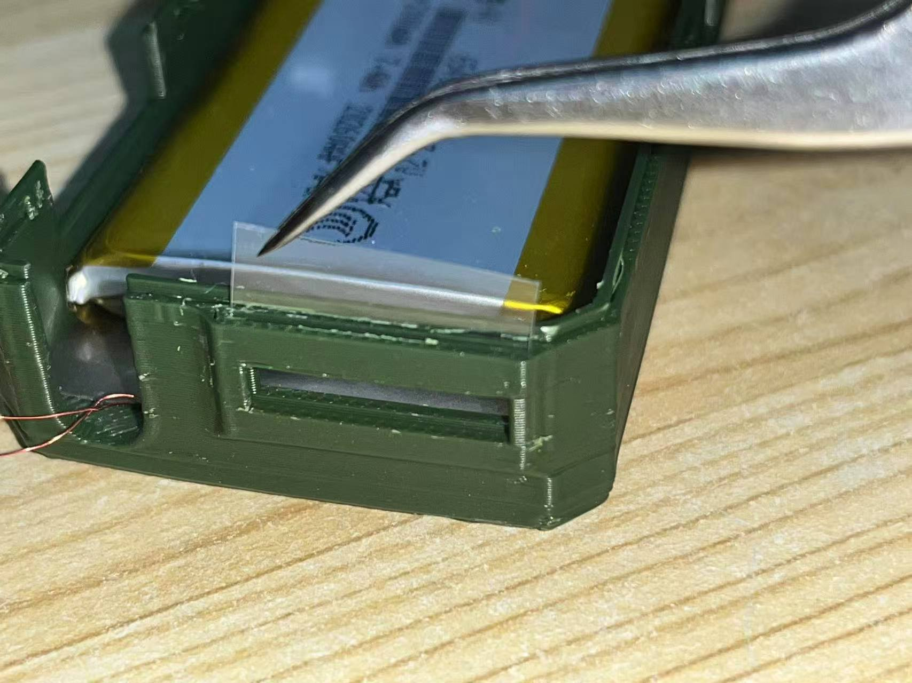